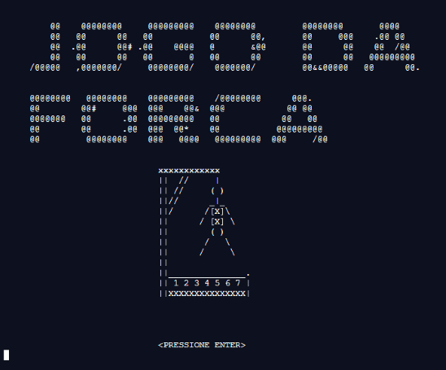

# JogoDaForca.c 🧩
Trabalho apresentado ao Prof. Me. Leandro Figueiredo Alves como requisito parcial a obtenção de nota referente a segunda avaliação na disciplina de Técnicas de Desenvolvimento de Algoritmos do curso de graduação em Ciências da Computação do Centro Universitário de João Pessoa.
 

 
## :clipboard: Escopo
O jogo escolhido pela equipe foi o jogo da forca (hangman game), para o qual foram desenvolvidas duas modalidades de jogo: uma individual, em que um único jogador joga sozinho contra o programa (que sorteia aleatoriamente uma palavra a partir de uma lista pré-concebida pelos desenvolvedores); e um multijogador, em que dois jogadores se enfrentam criando uma palavra para o adversário adivinhar.

## :paperclip: Conteúdo adicional
Juntamente aos códigos foram elaborados:
* [Relatório de desenvolvimento](https://github.com/vncenturion/jogoDaForca/blob/main/Relatorio/relatorio.pdf); e,
* [Vídeo de apresentação](https://youtu.be/WxlwlNmHDtw) do jogo.
